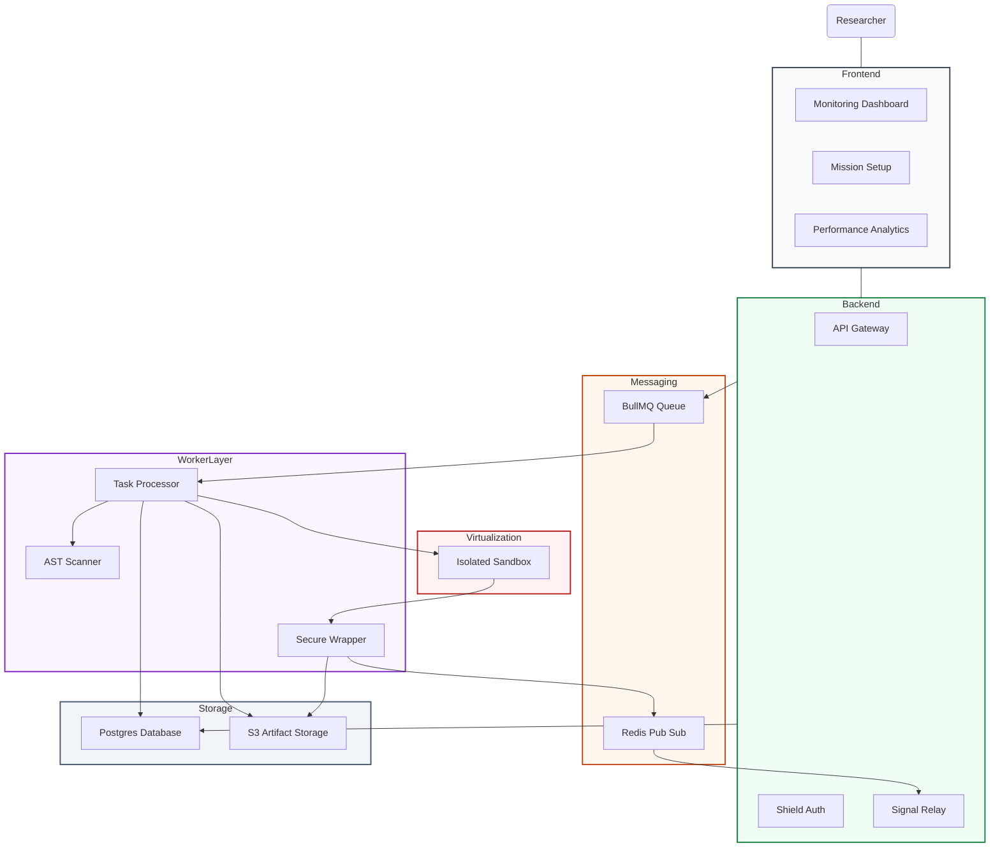

# Oubliette-AI: Enterprise-Grade Secure Sandbox for Untrusted ML Workloads


**Oubliette-AI** is a high-security execution platform designed to build, train, and version machine learning models while maintaining complete isolation from host infrastructure. It bridges the gap between research flexibility and enterprise security, providing a production-ready environment where data scientists can iterate safely and security auditors maintain full oversight.

---

## ⚡ Quick Highlights

- 🔐 **Zero-Trust ML Execution**: Sandboxed training environments with no network access and restricted syscalls.
- 🛡️ **AST-Based Malware Detection**: Proactive scanning for forbidden imports and homoglyph attacks before execution.
- ⚡ **Sub-ms Real-Time Observability**: Live log streaming from isolated containers via Redis Pub/Sub.
- 📦 **Content-Addressable Storage (CAS)**: SHA-256 deduplication reducing redundant storage costs by ~30%.
- 🧠 **Automated Model Lineage**: Full audit trail of every training mission, version, and performance metric.

---

## 🚀 Demo & Preview

> [!TIP]
> **Live Demo**: [Coming Soon](https://github.com/JafrinSam/Oubliette-AI) | **Video Walkthrough**: [Watch on YouTube](https://github.com/JafrinSam/Oubliette-AI)


---

## 📌 Resume-Style Impact

- **Engineered a Zero-Trust ML Lifecycle**: Developed a multi-layered security mesh combining Docker isolation and AST-based static analysis to enable the safe execution of untrusted research scripts.
- **Optimized Storage Architecture**: Implemented a Content-Addressable Storage (CAS) system using SHA-256 hashing, reducing dataset storage redundancy by **~30%**.
- **Architected Real-Time Data Pipeline**: Built a high-frequency observability pipeline using **Redis Pub/Sub** and **Socket.IO**, delivering training logs with sub-millisecond latency.
- **Hardened Execution Environment**: Mitigated host-level risks by enforcing network isolation (`NetworkMode: none`), stripping Linux capabilities (`CapDrop`), and applying `RLIMIT_AS` memory hard-caps.

---

## 👨‍💻 Why I Built This

While exploring ML infrastructure, I identified a critical security gap: **executing third-party experimental code is inherently dangerous.** In a corporate setting, a single malicious script could exfiltrate sensitive datasets or compromise the entire host.

**Oubliette-AI** is my exploration into how **cybersecurity principles (Zero-Trust/Least-Privilege)** can be applied to **MLOps**. It’s not just a training tool; it’s a secure system designed to protect data and infrastructure from the code it runs.

---

## 🧪 Security Deep Dive (The "Russian Doll" Model)

Oubliette-AI doesn't just "run code"—it inspects, normalizes, and isolates it before it ever touches a CPU.

1.  **Static Analysis**: Every script passes through a custom AST visitor that detects homoglyph attacks (e.g., using `eⅹec` instead of `exec`) via **NFKC Unicode Normalization**.
2.  **Signature Verification**: Integrated **Bandit** scanner checks for insecure coding patterns and hardcoded credentials.
3.  **Kernel-Level Isolation**: Containers are provisioned with no network, read-only host mounts, and dropped capabilities to prevent escalation.
4.  **Resource Quotas**: Proactive protection against Algorithmic DoS via fixed memory/CPU limits and execution timeouts.

---

## 🏗️ System Flow & Architecture




> 📌 **Architecture Insight**: This project implements an asynchronous, event-driven model. The API server remains lightweight and responsive, offloading heavy training workloads to isolated workers while streaming real-time telemetry back to the dashboard via Redis Pub/Sub.


---

## 🛠️ Tech Stack

- **Frontend**: React 19, Vite, Tailwind CSS v4, Framer Motion, Recharts.
- **Backend**: Node.js, Express, Socket.IO, Prisma ORM.
- **Worker/Security**: Docker Engine API, Python (AST, Bandit), BullMQ.
- **Infrastructure**: PostgreSQL, Redis, MinIO (Object Storage).

---

## ⚙️ Installation & Usage

### 1. Launch Infrastructure
```bash
docker-compose up -d
```

### 2. Start Services (In separate terminals)
```bash
# Server
cd server && npm install && npx prisma migrate dev && npm run dev
# Worker
cd worker && npm install && npm run dev
# Dashboard
cd client && npm install && npm run dev
```

---

## 📈 Future Scope (Product Evolution)

- [ ] **Multi-Tenant Isolation**: Enterprise-level department-based workspace isolation.
- [ ] **Kubernetes Orchestration**: Scaling workers across distributed K8s clusters.
- [ ] **eBPF Monitoring**: Real-time syscall monitoring for active threat detection.
- [ ] **H/W Acceleration Profiles**: Granular GPU resource allocation per mission.

---

## 👤 Author

**Jafrin Sam (Noxmentis)**  
*Cybersecurity Enthusiast | Secure Systems Builder*

🔗 **GitHub**: [github.com/JafrinSam](https://github.com/JafrinSam)  
🔗 **LinkedIn**: [Jafrin Sam](www.linkedin.com/in/jafrin-sam-j-05lkjhg/)  


---

